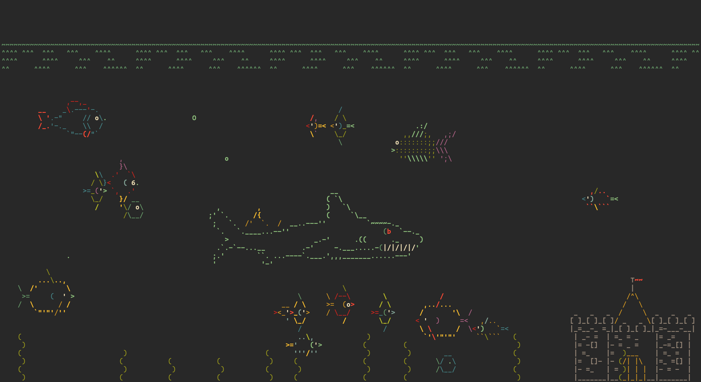

# Asciiquarium

A dockerized version of the legendary
[asciiquarium](https://github.com/cmatsuoka/asciiquariu). Made mostly because I
didn't want to install perl on my main system :D.



Many thanks to [cmatsuoka](https://github.com/cmatsuoka) for making this
wonderful terminal graphic!

## Usage

> Note, this container must **always** run interactively, otherwise it will
> immediately exit.

### Options 1: Pulling

The latest version should be available on Docker hub, so running it is as simple
as:

```
$ docker run --rm -it jarulsamy/asciiquarium:latest
```

### Option 2: Building

Clone this repo:

```
$ git clone https://github.com/jarulsamy/asciiquarium-docker.git
```

Build and tag the image:

```
$ cd asciiquarium-docker
$ docker build . -t asciiquarium
```

Run it:

```
$ docker run --rm -it asciiquarium
```
